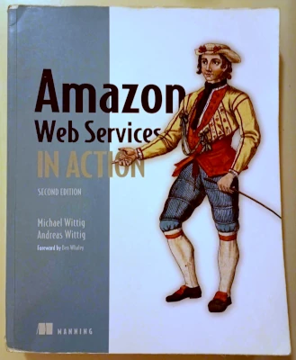
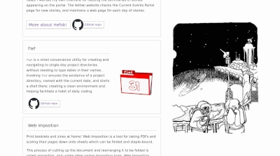
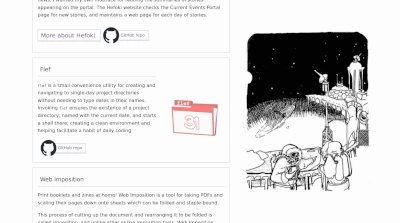

I last touched this website three years ago. Back then, it was a
single-page site with a custom Webpack setup, using Webpack like
a static site generator through Nunjucks templating. Now I've
remade, rewrote, and redesigned it with 11ty. There were several
such attempts, all failing to gain traction. Among these
attempts, I lost the momentum of inspiration or had none at all,
only knowing I wanted to make the site anew but without the
actual want to do so.

The coding was easy. The writing and content were not, but this
time I finished the redesign. This time was different because I
realized something, a concept I'm calling the "visual keystone".
After picking a single thing to base my visual design around, upon
which to form other decisions, the rest came.

## Design: The Eternal Enemy of Programmers

Finding things to write about myself and my projects is
challenging. Finding relevant imagery is even harder.

For quite a while, I wanted a new developer site, at multiple
points reattempting produce one I found appealing. Such a result
hadn't come. Among these attempts, I started with a wants-driven
approach. Knowing I wanted an 11ty site, knowing I wanted a
portfolio within which to organize things I've worked on, knowing
I wanted a place to put things I write, there seemed to be a
starting point. But where does one go from there? Does one start
with designing the site and composing words? Realistically,
knowing requirements as simple as these does not indicate the
next step.

In software, everything occurring is represented by the
electrical happenings within semiconductors. Code does not lend
itself to pictures. It would seem words are a better fit when
discussing software, as programs are written in their own
specialized languages. But although code is broken up into such
words, they make for poor reading material. If one could convey
their software by by displaying its code, expecting anyone to
read it, there would be no need to write about software. This was
at the core of my writers block. How does one design to present
software development?

### Using What I Have

When faced with an impasse in how to design a website for a
software developer, the easy solution is to grab some photos of
computer screens and coffee from Unsplash and call it a day.
Perhaps a cyber-looking abstract picture. But barring the cliche
and obvious, what image do you put next to information about a
program or a developer?

My answer to this problem takes inspiration from O'Reilly and
Manning books: <em>anything</em>. Here's a couple of their books,
off my book shelf:

<div class="books-container">
  
  
</div>

The O'Reilly book has an illustration of a different animal than
the one in its name, and the chap in the Manning book probably
hasn't heard of Amazon Web Services (I don't know, I haven't
asked him), but these covers are great, notwithstanding my poor
care for their physical condition.

Both software publishers have distinct styles for their covers;
O'Reilly with its line-drawn animals, and Manning with their
historical, painted fashion drawings. The selection of these
distinctive, recognizable illustrations clearly identifies their
catalogues. In other words, the answer to the question, "what
image do you put next to information about a program" is
"whatever looks nice."

As an aside, here's what O'Reilly and Manning have to say about
their covers:

* <a target="_blank" href="https://www.oreilly.com/content/a-short-history-of-the-oreilly-animals/">A short history of the O'Reilly animals</a>
* <a target="_blank" href="https://www.manning.com/covers">The Manning people (on our covers, that is)</a>

This takes it back to my website.

I've done Inktober a couple times. It's a drawing challenge where
illustrators are provided a series of prompts to draw every day
during the month of October. Full ink drawings can take 2-4
hours. It's grueling, but it made me a better illustrator through
regimen, and provided me a starting point for subject matter to
draw.

With all these drawings sitting doing nothing, I may as well use
them to solve my problem! If a drawing tangentially relates to a
subject I'm presenting, all the better, but relevance is
unimportant. The realization it doesn't matter is liberating. It
refocuses the design process from what I *want* onto what I
*have*.

This site was redesigned several times before I realized this.
Once I decided to use my illustrations, once I decided on this
one characteristic from which other design decisions would
derive, everything else became easier. That was the most
important thing: a central, visual keystone.

### Making a light theme even though I'm a computer vampire and light themes burn my eyes and flesh

Choosing my ink illustrations as the imagery to appear throughout
this site, I needed to determine how the other aspects of its
theme looked. How would the illustrations and the site's graphics
cohere?

My drawings have some common traits to build upon:

  * They tend to be high-contrast, pure black-and-white. Many use
    the negative white space to suggest the shape of objects.

  * Many of my drawings have frames drawn around them, but the
    subject of the image pops out of that frame.

  * The use of implied line. This is where the outlines of shapes in
    a drawing are omitted, and instead are suggested by the shape
    of other lines and shadows. In the drawing at the top of this
    post, look at the candle for an example of implied line.

  * I like putting down a *lot* of ink. Fills are fun!

For these, a white background which matches the negative space of
my drawings works best. They're drawn on white paper, after all,
and I considered their value composition accordingly. Web pages
are improved by contrast and variety in shape.

Visual diversity throughout the page provides users with a sense
of direction. It gives them landmarks throughout the page,
feeding their intuition. Juxtaposing curved lines with straight
lines, big shapes with small, dark with grey with light, and
other types of contrasts contributes to this variety.

Ink drawings can play into these qualities, these contrasts. If
the drawing has a hand-drawn frame or boundary, that is one less
use of straight lines. If the layout is the same in two parts of
the site, two images differentiate them.

As for color, I'm breaking away from the inspiration I find in
O'Reilly and Manning covers. A design choice which works well for
them is pairing a bold, solid color with their illustrations.
Solid band of this color will feature prominently on the
background of the book. If illustration is the primary trait of
their designs, pairing them with a vivid, solid color is the
secondary. Most of their illustrations will be in front of a
white background, but this color will sit behind the background
of its title.

When looking at my illustrations, however, that may not be the
best match with my style. This is because of the large ink fills in my
drawings, which would compete for value (darkness) distribution.
In drawings with stark ink fills, introducing color can muddy the
contrast. In fact, the way one inks an illustration may change
depending on whether color will be added. Until I change my mind,
I'm consciously sticking with a minimal palette: browser default
colors for links, and the use grey lines as an accent.

An example of this is found in the "Other Projects" section in my
front page. One of the projects I list, <a
href="https://github.com/GilchristTech/flef">Flef</a>, has a
red logo. Currently, the other projects do not. Emblazoning the
page in its full crimson vibrancy, it throws things off a bit. In
order to maintain the balance of contrast at that part of the
page, I reduce its opacity.

<div class="flef-screenshots">
  <figure>
    <figcaption>
      With the Flef logo at full opacity, its contrast against
      the rest of the page causes it to stick out, imbalancingg
      the layout.
    </figcaption>
    
  </figure>

  <figure>
    <figcaption>
      By making the logo more transparent, it doesn't
      interrupt the reading flow.
    </figcaption>
    
  </figure>
</div>

Similarly, the site uses grey lines, usually thin ones, as an
accent. I am partial to the color `#8888`, a 50% grey at 50%
opacity.  Above almost any background, `#8888` will always center
the color towards the same medium-grey. All-in-all, the intent of
these decisions is to give the site a "clear" look, while also
benefiting from the high contrast of the drawings. For this
reason, the site's appearance deviates little from the browser's
defaults theme.

Used deliberately, I suspect parts of the browser defaults may be
an effective graphical design choice in websites.
More and more, people spend their life using the same technology.
You'd be hard-pressed to find an adult who hasn't used the
internet for a decade. This gives web users a shared visual
language. For example, if someone sees a circle with an X in it,
they are likely to think it will close something. Most will see
blue text with an underline as a clicky thing that takes them
somewhere else. Web pages are variations upon the awful default
CSS theme in browsers, which makes the default fundamental to a
collective user conscious. Selectively maintaining parts of the
default browser theme taps into the collective intuition of web
users.

Even though I kind of hate light themes, that's why I'm going
with one.

### Ink CSS for a tentative dark theme

Even though this site has a light theme, even though there is
no dark theme, even though a light theme is *better* for this
website, I am a creature of the night and yearn for my website's
embrace of the dark. Plus, if one day I add a dark-theme toggle
button, then I get to be one of the cool kids.

Instead of creating a dark theme or a toggle button, I made my
`` tags uselessly dark-theme friendly. Well, it's not *that*
useless. Some browsers support overriding the background color of
a page to enforce a dark theme. Under normal browsing conditions,
you won't be able to see this `` styling feature, but in
browsers which support it, the black pixels in images with the
`.ink` class invert the background behind them. For black ink on
a white background, this does absolutely nothing.

Instead of creating a dark theme or a toggle button, I made my
`` tags uselessly dark-theme friendly. Well, it's not *that*
useless. Some browsers support overriding the CSS of a into a
page to enforce a dark theme. When that happens, black pixels in
images with the `.ink` class invert the background behind them.
For black ink on a white background, this does absolutely
nothing.

<div class="only-screen">
  <p>But in the interest of demonstration, here's an interactive demo:</p>

  <div class="demo-container">
    <ink-demo style="margin: 0 -0.5em; min-height: 175px;"></ink-demo>
  </div>

  <p style="font-size: 0.80em"><em> This demo is a web component defined in <a href="./static/ink-demo.js">./static/ink-demo.js</a></em></p>
</div>

Here's the CSS for this ink theme.
```css
@supports (
    (filter: invert()) and
    (mix-blend-mode: difference)
) {
  img.ink {
    filter: invert();
    mix-blend-mode: difference;
  }
}
```

It's simple, but I think it's neat.  Both `filter` and
`mix-blend-mode` are required for this to work, because the image
would appear inverted if only one of the CSS properties are
present. It essentially works by inverting the image twice. For
this reason, the style is wrapped in a `@supports` at-rule.
Additionally, my hope is naming the class "ink" aids the semantic
readability of the HTML markup by making it more descriptive of
the content; that an `` is an ink image.

### Two-column layout with CSS grid hacks

With the illustrations being my website's chosen visual theme,
and with a decision on colors made, what remains is
the layout. 

At the time of writing, this redesign has four pages:
[Home](/),
[About](/about),
[Interbuilder](/interbuilder),
and [Hefoki](/hefoki).
The last two are project pages. Functionally, these pages are
intended as overviews. On such pages, their design can be more
presentational, more fancy. This is different from if the pages
were are like the one you're reading now, a page comprising
largely of text.

The visual keystone is the illustrations. For these pages, they
can take up a large proportion of space. For this, I divide
sections within the page into two columns, one with the picture,
and one with the document content. As the user scrolls, sticky
positioning makes the image follow the user.

On mobile, this doesn't work well. Both the text and image get
too narrow for a phone screen, so a media query rearranges the
layout. Instead of using sticky positioning within a grid layout
on a narrow screen, the image appears below the heading using the
default browser flow layout. From there the size of the image is
bound to a maximum percentage of the screen height.

<div class="only-screen">
  <p>Here's a rough demo for this type of responsive layout:</p>

  <demo-layout style="border: 1px solid #8888; box-shadow: 1px 2px 16px #0004"></demo-layout>

  <p style="font-size: 0.80em"><em> This demo is a web component defined in <a
  href="./static/demo-layout.js">./static/demo-layout.js</a>.
  Admittedly, I made it as an excuse to mess with container
  queries and have fun with CSS.</em></p>
</div>

The HTML for this is dead-simple. The main CSS property set to
change the layout is the container's `display` property between
`block` and `grid`, and setting elements' `grid-column` property
when using the grid layout. Switching layouts this way maintains
a reasonable document flow and keeps the markup flat, like so:

Switching between a grid-based
layout in desktop and to the browser's default flow positioning
in mobile makes the markup flat, like so:

```html
<section class="vertical-split">
  <h1>Lorem Ipsum</h1>
  
  <p>Amet ratione fugit at atque possimus?</p>

  <h2>Ipsum incidunt!</h2>
  <p>Elit ab saepe similique suscipit.</p>
</section>
```

There's just one container, `.vertical-split`, and it's at the
top. For the image, one class, `.slide` is to be applied to a
direct descendant. 

Here's an abridged version of the current CSS:

<div class="limit-code-height">

```css
.vertical-split {
  max-width: 1200px;
}

.vertical-split {
  @media (
    (min-width: 900px) or
    ((orientation: landscape) and (min-width: 750px)) 
  ){
    display: grid;
    --split-width: 350px;

    grid-template-columns: var(--split-width) auto;

    grid-column-gap: 2em;
    @media (max-width: 1000px) {
      grid-column-gap: 1em;
    }

    /*
      By default, place items in the left column,
      unless this has the .flip class
    */
    & > :where(*) { grid-column: 1;  }
    & > .slide    { grid-column: 2;  }
    & > .span     { grid-row:    2 / span 9999; }

    &.flip {
      & > :where(*) { grid-column: 2; }
      & > .slide    { grid-column: 1; }
      & > .span     { grid-row:    1 / span 9999; }
    }

    & > .left  { grid-column: 1 }
    & > .right { grid-column: 2 }
    & > .slide { grid-row:    1 / span 9999; }

    & > picture.slide > :is(img, src),
    & > img.slide {
      position: sticky;
      top: 0%;
      width:  100%;
      height: 100%;
      max-height: min(100%, 100vh);
      max-height: min(100%, 100dvh);
    }
  }
}

.vertical-split > :where(img) {
  margin:     0 auto;
  width:      auto;
  max-height: 200px;
  max-height: 50vh;
  max-height: 50dvh;

  object-fit: contain;
  object-position: center;
}
```

</div>

This does various things. 

* If any of the CSS features I'm using are unsupported, this should
  fail somewhat gracefully.

  The most risky CSS feature used, at the time of this writing,
  is CSS selector nesting. When making static websites in the past,
  I've tended to use SCSS for this very feature, but today it's
  in CSS Baseline 2023 and has 91.53% browser support. 

  I've viewed this site with ancient, forbidden browsers. With
  the site being readable in IE5-6 and Safari from 2005, I think
  it's fine.

* This component is very simple to add variety to site the layout by
  horizontally swapping which columns have the image and text
  content. The `.flip` class will do this.

* A CSS variable to controls the size of the split, and in HTML
  an inline style can change this value. This makes the design
  quick to change, while maintaining responsiveness.

* Pure CSS lets the browser do what it's good at, making the
  page faster.

Because this layout has classes and and variables which can tweak
it, I've used it for all of the sections in the initial set of
pages in the site. If I ever need to change the layout, because
the HTML is flat, document-style HTML, it will unlikely need to
be changed. And most importantly, it works for showing the
images.

## Inconclusion

This article was more ambitious in its early drafts, but that was
preventing me from finishing it. Ironically, there was a portion
on accepting incompleteness in order to move things along, and
holding onto that held back my progress. Similarly, I also wrote
about splitting and distributing content across multiple pages,
and I wound up doing that in this article, moving 1500 words into
their own documents. Earlier drafts had sections on the site's
written content and coding the static site generation.  It's
possible I talk more about these things in the future, but I
figured it best to trim the scope of the article. Focus is a good
thing.

Ultimately, if I were to distill my recent efforts into advice
for other developers who need to perform some design work, figure
out what you have. Perhaps you have some software you can compile
into a web-based demo. Or if not, perhaps pick an arbitrary image
theme, as I did. Maybe you're working with people who have visual
assets. Whatever the case, take what you have and use that as
your visual keystone. That demo needs a color scheme which frames
it well. Images with texture can look good next to flat colors.
Hopefully from there, the rest will come easily.
