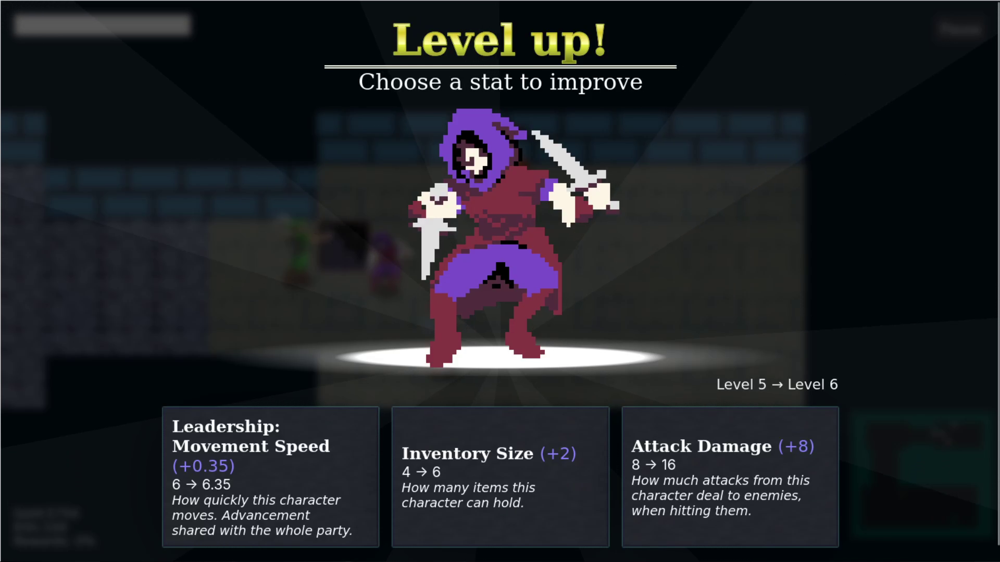
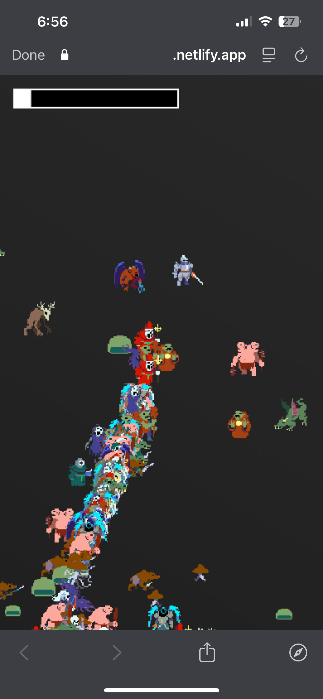
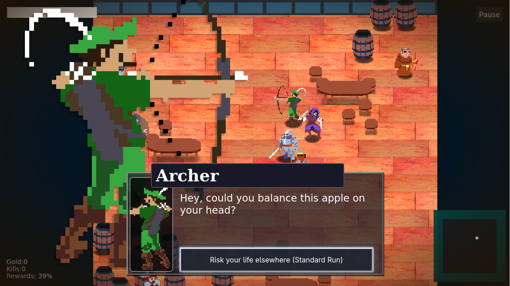

Since March (roughly), I've I've been developing a web-based game.
I had intended to close out this year announcing what I've been
working on with an initial playable demo, but not before
polishing some of the less usable parts. But that taking longer
than expected. Instead, I'm writing about the first month of
development, and adding playable versions of the game in its
early form into the article. Looking back at my commits, I'm
surprised by how much progress I made on the game was in April alone.
In that time it went from a rough concept I wanted to explore to
something where I could field new ideas.

<figure>
  
  <figcaption>A recent screenshot from the game. This is far newer than
  the contents of this article</figcaption>
</figure>

Which takes me to the concept: this is a game in the genre of
Vampire Survivors, Brotato, or Megabonk, where the player has few
controls other than movement and they collect level-ups which
make their automatic attacks more powerful. In most of these
games, you collect more weapons to shoot *even more* projectiles and
kill an obscene number of enemies. My twist on the genre is
that instead the player collects party members who orbit them,
and levels up each party member individually. 

## The Ur-Game: Before the Repo

Up until this point, I was using my
miniproject approach: having an outline for a small goal and try
to make it each day in the form of single-day projects, building
everything anew each day instead of continuing off the efforts of
the previous day. Project directories were created using
my CLI tool, [`flef`](https://github.com/GilchristTech/flef).
This approach helps bolster fundamentals, memory, and development
speed. I highly recommend it!

To get the project off the ground with sprite assets, I used the
[32rogues spritesheet](https://sethbb.itch.io/32rogues) pack by Seth on itch.io, which they released
as free for personal and commercial use. I'm gradually
making my own sprites, but this delightful sprite pack has been
instrumental in the creation of this game, and I'm thankful for
Seth's work.

I can't find any of my project files from this time, but I recall
those builds of the game had to do with state management, entity positioning,
and making sprites lower on the screen get drawn above others.

The build stack was dead-simple: the [11ty](https://11ty.dev/)
static site generator would directly copy my JavaScript source
code into the build (if you could call it a build). The only need
I had was auto-refreshing the page when I modified scripts and
11ty has a dev server which fit the bill. Today, I use Vite
instead of 11ty, although the project is still programmed in
vanilla JavaScript.

# April 3rd: Initial Commit

My initial commit! 

<style>
  #initial-commit {
    font-size: 1.5em;
  }
  #initial-commit code {
    text-wrap: wrap;
    text-wrap: balance;
  }
</style>

<div id="initial-commit">

> ```
> Initial commit for browser game with character select and auto-shooting enemies
> ```

</div>

In this initial commit, I implemented a character select screen (where
the only differences between characters were cosmetic), movement,
enemies, attacking, health, and player death.

On the 3rd and 4th, I made about 13 commits. Many of those added
stats and changed how  how movement worked. I added a main menu
with a start button, a system for adding and removing elements to
the DOM based on game state, and six characters with different
stats.

At this time, the stats were:

* HP
* Attack damage
* Piercing amount
* Range
* Speed
* Invicibility frames
* Attack cooldown
* Hitbox size,
* Attack spread
* Attack projectile size

A balancing issue became apparent from the number of invicibility
frames characters would have, where I tried to give some
characters more time where they invincible between hits from
enemies. This would make some characters able to stand in a group
of enemies and take an unreasonable amount of time to die, while others would expire instantly.  Getting this to feel fair has been an
tug-of-war between game balance and game feel. 

**Demo:**

*(click to start. The controls are WASD, or clicking and dragging
to move)*

<iframe width="100%" height="650px" src="./static/builds/04-04/index.html"></iframe>

Another issue of the early game is that it took place completely
in a void. Eventually I would work on this, but early on my focus
was mechanical, not aesthetic.

# April 7th: Stopping the Mob Train

I'd like to focus on this day in particular, because I think it
demonstrates an approach to the development of this game that I'm
proud of: using math and relying on random distribution instead
of algorithms to solve problems.

I had a friend of mine play the demo, and she sent me back this
screenshot with "we love the mob train."

<figure style="display: flex; flex-direction: column; align-items: center">
  
  <figcaption>We love the mob train.</figcaption>
</figure>

As delightful as the Mob Train is, it presents a
lack of variety. Don't get me wrong, most games in this genre
will send enemies right towards you and it's not an issue. My
vision for the game, however, is to be a dungeon crawler with
tight walls and for enemies to flank the party. The fewer enemies
clump together, the better.

So how does one address the Mob Train? Problem A: scaling. If you have
each enemy analyzing its own state to calculate their movement on
each tick, that adds up across thousands of enemies.

Problem B: uniformity. Enemies which march at you head-on are the
simplest to program: just get the direction towards the player
and move towards direction by certain distance on each game tick.
Easy-peasy! When you replicate this behavior across many enemies,
unfortunately, they converge into a single line if you move in
one direction.

My solution had two parts: first, making enemies only recalculate
their movement on 5% of the game's ticks, where each enemy is
put into one of 20 "bins" for which tick in a rotation of 20 they
are allowed to recalculate in; then to assign each enemy a random
angle to steer their movement away from the player when chasing
at a certain distance.

The recalculation throttling looks something like this:
```javascript
// When the enemy is created, put them into one of twenty "bins".
enemy.recalculation_offset = Math.floor(Math.random() * 20);

// Enemy tick code
if ((tick + enemy.recalculation_offset) % 20 == 0) {
  enemy.recalculateDirection();
}
```

This is a pattern I use extensively throughout the game, and it
allows me to run computationally-expensive entity operations less
frequently if I need to improve performance. With randomness over
many entities, the bins receive a mostly-even number of
entities, helping address the scaling issue, problem A.

After messing around with the Desmos graphing calculator for a
while, I came up with this formula for biasing enemy movement:

<div style="display: flex; flex-direction:column; align-items: center;">
  <math style="font-size:2em">
    <mrow>
      <mi>bias</mi>
      <mo>=</mo>
      <mn>1</mn>
      <mo>-</mo>
      <msup>
        <mrow>
          <mo>(</mo>
          <mrow>
            <mn>2</mn>
            <msup><mi>x</mi><mi>s</mi></msup>
            <mo>-</mo>
            <mn>1</mn>
          </mrow>
          <mo>)</mo>
        </mrow>
        <mrow><mn>2</mn><mi>f</mi></mrow>
      </msup>
    </mrow>
  </math>
  
  <p>(Here, <math><mi>s</mi><mo>=</mo><mn>0.5</mn></math> and <math><mi>f</mi><mo>=</mo><mn>1</mn></math>)</p>
</div>


Where <math><mi>x</mi></math> is a
value between 0 and 1, representing how far within the biasing
chase range is, *i.e.* if a character is 25% of the distance of
the biasing range of the player, <math><mi>x</mi></math> would be
0.25 and they would be at the peak of their bias.

```javascript
// Get a random angle within a given spread for this enemy's bias
enemy.target_bias = Math.PI * (
  (2*Math.random()-1) *
  (enemy.target_bias_spread - enemy.target_bias_min) +
  enemy.target_bias_min
);

// When recalculating direction...
const target_theta  = Math.atan2(rise, run);
const bias_distance = this.character.target_bias_range - target_distance;

if (target_distance > bias_distance) {
  this.dx = Math.cos(target_theta);
  this.dy = Math.sin(target_theta);
  return;
}

// The enemy is inside the biasing range, but outside of the biasing deadzone.

const bias_coefficient = 1 - Math.min(
    bias_distance,
    this.character.target_bias_range
  ) / this.character.target_bias_range;

// Based on the proportional distance of the enemy within the
// biasing range, get an angle to add to the direction
// towards the target. This expression marks the strength of
// the bias on a left-skewed curve, where the enemy having a
// further distance makes them more immediately and strongly
// pulled by the bias, with the bias gradually reducing the
// closer they get to the target.

const bias       = (1 - Math.pow(2, Math.pow(2*bias_coefficient, 0.5)));
const bias_theta = enemy.target_bias * bias;
const direction  = target_theta + bias_theta;

enemy.dx = Math.cos(direction);
enemy.dy = Math.sin(direction);
```

By initializing enemies with random timing and geometric values,
behaviors are varied across enemies, and the code enabling that
variety has fewer branches in execution.

<iframe width="100%" height="650px" src="./static/builds/04-07/index.html"></iframe>

I've never received that formal of a mathematical education, but
it's been refreshing to take a more math-driven approach than I'm
usually accustomed to. Many problems in this game have been
solved by calculating weighted sums of vectors. When scaled
over randomized distributions of entities I'm surprised at how
well the results turn out for the amount of effort they take.

## The Gamemaster

The game now had a working name:

Uh, so that would need some work. I dislike naming things, but
I'm happy to say that today the game has a name that I think is
fun. I'm looking forward to announcing that in the near future!

> **Gill's Untitled Auto-Shooter Dungeon Game**

This all was great, but what was the point? The game needed one
very important thing: a goal. Games in this genre tend to be
played in runs. You sit down for a half-hour or so and want to
get through a set number of levels, or survive for a certain
amount of time. The idea I wanted to go for was exploring dungeon
floors, but before that, I implemented advancing through levels
by killing a certain number of enemies. Today, most levels have
an exit to reach, but I've kept the original behavior in the form
of 'arena mode' runs. It's been interesting to see how the game
feels when the goal changes. 

<iframe width="100%" height="650px" src="./static/builds/04-17/index.html"></iframe>

Having multiple levels and goals to progress through requires some
sort of apparatus in place which manages runs, their levels, and
the state of the game. For this, I came up with a system I call
the Gamemaster, as it functions much a GM in tabletop
RPGs. Today the Gamemaster creates the levels for the player to
play in, tells them when they can level up, presents the player
with the option to recruit party members, shows them shops for
items, adds enemy spawners that accumulate throughout the run,
collects gameplay statistics, and (most importantly for this point
in the development of the game) tracks the win conditions for
the run. 

In between this, I added various other things, such as random map
generation and wall collision, predetermined enemy spawners to
organize groups of enemies which appear as runs progress, and
many small tweaks.

## April 18th: Got to the Gimmick!

The idea I wanted to explore, party members, finally started!
As you get more party members, they circle around you while you
move.

<iframe width="100%" height="650px" src="./static/builds/04-18/index.html"></iframe>

For the motion of party members, this is another point where I
took a mathematical approach. For this, I take the current point
in time and project it into a circle around the player, like the
seconds hand on a clock. This gives a point spinning around the
player, and create a vector from it.  The party member always
moves along that vector, drawing them to a spinning path around
the player. 

However, with this alone, your party members will blindly run
into enemies and die! So, I add in another vector: the retreat
vector. To calculate the retreat vector, I get all enemies within a range of
the party member, and get each vector towards that enemy. These
vectors are all added together, weighted by how close an enemy
to the party member. This gives a vector towards the
most central position of enemies, and by flipping that in the
opposite direction, I have the best direction for running away.

To determine which direction the party member is moving, take the
orbit vector and the retreat vector and calculate an average
weighted how many enemies are close to the party member. With
these two combined, the party member will circle around the
player, swerve away from enemies, and run away if there are too
many. I got many of the behaviors I wanted with very little
branching logic.

## April 30th: The first month

By this point, the game was really starting to take shape.
The first form of player scaling was accumulating party members,
and the next was level-up options. The party members being their
own characters was something I was excited to work on. Today,
there are more options, including a meta-advancement which improves
level-up power in future runs and equippable items that can be
swapped between your party members.

<iframe width="100%" height="650px" src="./static/builds/04-30/index.html"></iframe>

The other major thing added by the end of the month was an
evaluation of the game's goal: exits to the levels. You
could still win by killing a certain number of enemies, but the
number was significantly higher. The reason for maintaining that
win condition was that sometimes your party would spawn in a room
that enemies would funnel into the entrance of, and you'd be
stuck. By now, I think I've tweaked the balance of things to the
point that this doesn't occur often, but it's a balancing problem
which required quite a bit of adjustment.

Also, random distribution of behaviors makes a comeback here!
When enemies are spawned, they are assigned a member of your
party to chase after. This causes enemies to spread out more as
your party wanders, and it becomes another thing the player can
maneuver around. And when one of your party members dies, all of
the enemies who were chasing them turn towards the remaining
party, and you get to see a grouping of enemies suddenly get
added to the one you're fighting.

<figure>
  
  <figcaption>Another recent screenshot.</figcaption>
</figure>

This relates to something at the forefront of what I've been
trying to do when working on this game: each change should add
variety for the player. It may be a new thing they can do, or
maybe a new challenge or behavior for them to deal with. Focusing
on variety is a good motivator of change.
